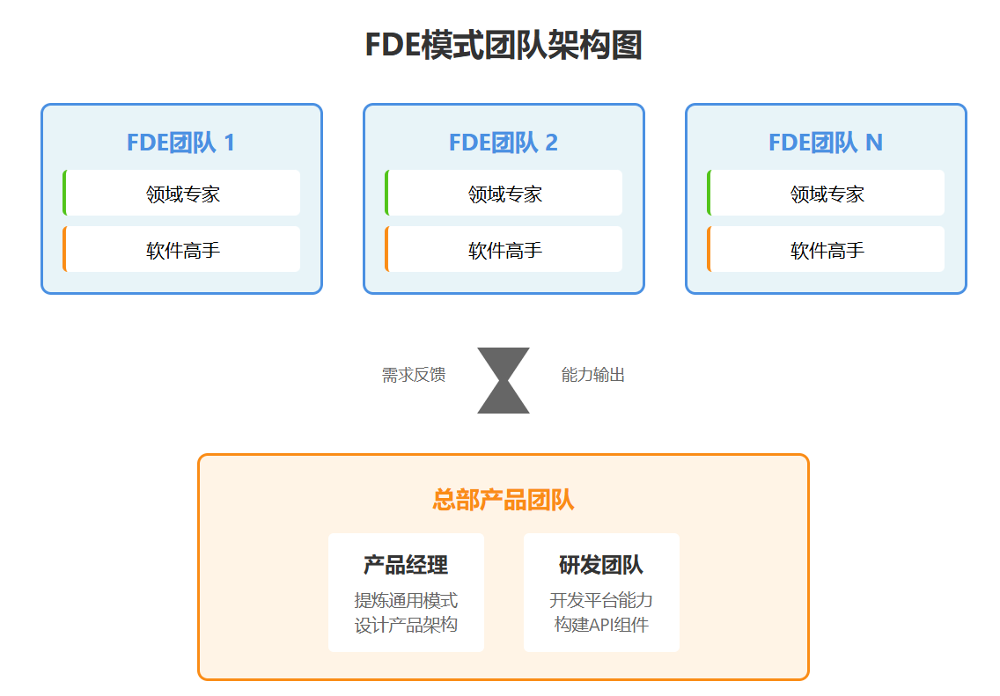

+++
date = '2025-09-15T15:40:36+08:00'
lastmod = '2025-09-15T15:40:36+08:00'
title = 'Buss101：智能体公司落地方法论'
description = ""
author = "Lloyd Sun"
tags = []
categories = []
ShowToc = true
ShowReadingTime = true
ShowWordCount = false
ShowPostNavLinks = true

TocOpen = false
searchHidden = false
ShowShareButtons = false
ShowBreadCrumbs = false
draft = false

+++

# 智能体公司落地方法论

# –从硅谷明星公司Palantir的FDE模式说起

## 01 Palantir的FDE模式

2000年代中期，Palantir面临着一个独特的挑战：为美国情报机构开发数据分析软件。问题是——没人知道间谍究竟是怎么工作的。

"就算你找到一个间谍，问他具体做什么，他通常也不会告诉你。"Palantir前首席研究官Bob McGrew回忆道。

面对这个完全陌生且高度保密的用户群体，Palantir只能摸着石头过河：先基于想象做个Demo，拿给客户看。客户的反应往往很直接："这东西太烂了，跟我们实际工作完全没关系。"然后创始人会追问："那要怎么改才有用？"收集意见，连夜修改，第二天带着新版本再来。

就这样不断迭代，Palantir终于找到了产品市场契合点。但新的问题出现了：每个客户部门——国家情报、执法、军队反恐——工作流程都截然不同。为A客户开发的功能，B客户完全用不上。如果试图把所有功能都塞进一个产品，结果就是谁都用不好。

在这个两难困境中，Palantir的CTO提出了一个反直觉的想法：既然无法避免定制化，不如把"定制化"本身变成核心能力。

这就是FDE（Forward Deployed Engineer，前线部署工程师）模式的诞生：**派工程师直接驻场在客户公司，利用平台化产品作为基础，再编写代码解决现场具体问题**。这些工程师铺设的是一条条"碎石路"——虽然简陋，但能立即解决问题。而总部产品团队的任务，是把最有价值的"碎石路"修建成标准化的"高速公路"。

这种"在规模化状态下持续做无法规模化的事"的模式，违背了硅谷的传统信条，却成就了Palantir独特的护城河。

## 02 智能体/AI公司与Palantir面临问题的相似性

我们正站在一个巨大的断层前。技术端，大模型迭代速度令人目眩——GPT、Claude、Gemini轮番刷新认知边界。应用端，企业却在原地踏步，那些令人惊叹的AI演示，一旦落到具体业务场景就变得水土不服。**能力与落地之间的鸿沟，正在迅速扩大。**

为什么会这样？答案藏在Palantir二十年前的经历里。当前AI公司与当年的Palantir，面临着惊人相似的困境：都在定义一个前所未有的产品品类。这不是优化，而是创造。"AI Agent"这个词掩盖了巨大的差异性。

以制造业为例：一个钢铁厂需要的设备预测性维护Agent，要处理的是高频振动数据和温度曲线；一个汽车工厂的质检Agent，关注的是视觉缺陷识别和装配顺序；而电子厂的产线调度Agent，核心是处理复杂的工序依赖和产能平衡。即便都在制造业内部，这些Agent的工作逻辑、数据结构、决策流程也完全不同。

这就像Palantir当年发现的：同样是"政府部门"，情报分析和军事反恐的工作方式天壤之别。**每个细分领域，实际上都是一个独立的市场。**

更深层的挑战在于：没人知道答案应该是什么。做新CRM挑战Salesforce很难，但至少目标明确。而AI Agent？连客户自己都说不清想要什么——他们只知道现有流程的痛点，却无法想象AI能带来怎样的变革。**市场上没有成熟的标杆，没有最佳实践，甚至没有清晰的产品定义。**

面对这片无人区，传统方法全部失效：市场调研问不出真需求，竞品分析找不到参照物。唯一可行的路径，就是深入一线，与客户共同探索。

这正是FDE模式在今天突然火热的根本原因——它不是众多选择中的一个，而是探索未知领域的必然方法。

## 03 FDE模式实践方式–两个关键团队中的三个关键角色

FDE模式的精髓是一句看似矛盾的话：**在规模化的状态下，持续做无法规模化的事**。这需要精巧的组织设计，让"定制化能力"本身成为可复制的核心竞争力。

### 3.1 FDE团队：前线的价值创造者

FDE不是传统的实施团队，而是**基于公司平台产品，在客户现场快速定制解决方案**的特种部队。这个定位决定了团队需要两类互补的角色。

- **领域专家**是价值发现者，核心特质是"深谙行业"和"永不满足"。深谙行业不只是懂技术参数——要知道高炉温度波动意味着什么，理解产线停工的连锁反应，能用工人的语言讨论问题。但更重要的是"永不满足"，这种叛逆者思维让他们能看到别人习以为常的荒谬之处。当所有人都接受"盘点需要停产三天"时，他们会问"为什么不能实时盘点？"正是这些问题，指向了10倍改进的机会。

- **软件高手**是价值实现者，核心特质是"快速编码"和"能吃苦"。快速编码不是写完美代码，而是基于平台快速搭建——像搭积木一样调用组件和API，三天出原型，一周见效果。能吃苦则是心理韧性——客户会质疑、需求会反复、时间永远不够，但他们始终保持交付导向。最好的软件高手，能在嘈杂的车间里保持专注，在充满变数的环境中稳定输出。

- **FDE团队的成功标准是交付价值的持续提升**。从解决单点问题到优化整条产线，从月度报表到实时决策，客户为越来越大的价值买单——这证明FDE真正进入了企业的核心业务。

### 3.2 总部产品团队：高速公路的建设者

总部的使命是**把FDE验证过的碎石路升级为高速公路**，让个案成功变成可复制的能力。

- **产品经理**是这个过程的架构师，核心能力是"提炼通用模式"。当三个FDE分别反馈"钢铁客户要监测炉温"、"化工客户要追踪反应压力"、"食品客户要控制发酵温度"时，平庸的产品经理会做三个监测功能，优秀的产品经理会看到背后的共性——都是关键参数的异常检测。然后设计一个通用框架，今天处理温度压力，明天就能处理振动电流。这种抽象能力的高低，直接决定了产品能否真正规模化。

- **研发团队**负责把设计变成坚实的平台能力。他们构建的不是功能，而是赋能工具——强大的API、灵活的组件、智能的框架。每个版本发布，都要让FDE的工作更轻松一点。

**总部团队的成功标准是产品杠杆的不断增强**。第一个钢铁客户需要3个月部署，第十个只需要3周——这就是平台的力量。如果第十个还是3个月，那就不是产品公司，而是咨询公司。

### 3.3 双向循环：知识在组织中流动

FDE模式的生命力在于一个简单的循环：

- **FDE在前线铺设碎石路**，快速解决客户的具体问题。每个项目都会发现一些"被反复使用的模式"——某个功能在多个客户那里都需要，某种集成方式特别高效。

- **总部识别通用模式并产品化**。产品经理分析这些模式，提炼共性需求；工程团队将其开发成平台功能。昨天FDE写的100行定制代码，今天变成了一个标准API。

- **平台能力反哺前线**。下一个FDE面对类似需求时，调用API即可，不必重新开发。节省出的时间，可以去探索更深层的业务价值。

随着这个循环不断运转，平台越来越强大，FDE的效率越来越高，能解决的问题越来越复杂。这就是FDE模式的精髓：**每一次定制都在为未来的标准化铺路**。

### 3.4 FDE模式下的团队架构示例

FDE模式的组织设计极其精简。最小可行配置是一个2人的FDE团队（领域专家+软件高手）加上总部的1人（产品经理兼研发）。随着客户增加，FDE团队数量线性扩展，但总部始终保持精简。

运作时，多个FDE团队在各自客户现场并行作业，他们发现的模式和需求汇聚到总部产品经理处。产品经理识别共性需求后，研发团队将其开发成平台功能，这些新能力又通过平台反哺给所有FDE团队。

这种架构的精妙之处在于其扩展逻辑：FDE团队数量随客户增长，但总部通过不断增强的平台能力支撑更多团队。成熟期，每个FDE团队能服务的客户数量可能翻倍，而总部人员基本不变——这就是真正的规模化。

## 04 FDE模式的独特价值

### 4.1 FDE vs 咨询

FDE是咨询的变种吗？答案藏在一条曲线里。

咨询公司的项目曲线是平的——第一个项目3个月10个人，第十个项目还是3个月10个人。收入翻十倍，成本也翻十倍。这是一门体面的生意，但不是一个非线性增长的模式。

FDE公司的曲线必须是陡峭的。第一个钢铁客户，FDE团队花3个月写了上万行代码。第十个钢铁客户，调用标准API，3周搞定。这背后是一个关键区别：**咨询公司交付的是人力，FDE公司积累的是产品。**

所以判断很简单：如果你的第十个客户还在重复第一个客户的工作，你就是咨询公司。如果FDE在前线拼命写的代码没有变成平台的一部分，你还是咨询公司。

真正的FDE公司，每一个项目都在为下一个项目铺路。今天的定制，是明天的标准。

### 4.2 交付软件 vs 交付价值

传统SaaS的逻辑很简单：这是我的软件，一个账号100块，用多少买多少。客户买的是"使用权"。

FDE模式改变了游戏规则：客户不关心你的软件多厉害，只关心他的问题能否解决。残次品率降低1%值多少钱？产线效率提升20%值多少钱？交付周期缩短一周值多少钱？面对大客户时，可以自信地说："先不谈价格，我们先把您的残次品率降下来。如果三个月后您觉得值100万，就付100万；觉得值1000万，就付1000万；觉得没价值，我们分文不取。"

**这种自信，比任何POC都有说服力**。因为你不是在卖一个产品的可能性，而是在承诺一个结果的确定性。当然，这要求你真正理解客户的业务，能够承担交付风险，并且有能力量化价值。但一旦做到，你获得的不只是订单，而是一种全新的客户关系——你们成了利益共同体。

## 总结

FDE模式的精髓，浓缩成一句话："**Doing Unscalable Things at Scale**"。这听起来自相矛盾，却恰恰是这个时代最需要的智慧。

当AI模型能力指数级增长，但企业应用举步维艰时，我们需要的不是更强的模型，而是更好的落地方法。FDE模式提供了一个反直觉但有效的答案：不要试图消除定制化，而要让定制化本身成为核心能力。

在这个体系里，每个FDE在前线的"脏活累活"都有价值——他们不是在做重复劳动，而是在探索未知领域。每一条艰难铺设的碎石路，都可能成为未来的康庄大道。个性化服务不再是规模化的敌人，而是规模化的养料。

对智能体公司而言，这可能不是一个选择题，而是一道必答题。因为在一个没有地图的领域，你无法站在远处规划路线。你必须走进迷雾，一步一步探索，一个客户一个客户地创造价值。

**未来的AI革命，不会因为某个模型的突破而自动到来。它需要千千万万个FDE团队，深入到各行各业的毛细血管中，用智慧和汗水，把AI的潜力一点一点转化为现实的生产力。**

这条路很难，但这是唯一的路。

## 参考资料

1. [FDE 模式席卷硅谷：一线驻场成为 AI 大模型落地的唯一解法](https://www.toutiao.com/article/7548064134601785882/?category_new=__all__&app=news_article&timestamp=1757463372&share_uid=MS4wLjABAAAAYkofya2H69UNDitfRynOLR4FycM3pvBPUO2QdD17JIovfkeKh73xS2PUUhi2MRzI&share_token=5bed240f-8ddb-11f0-9b95-32e82f8ca49b&share_did=MS4wLjACAAAAYkofya2H69UNDitfRynOLR4FycM3pvBPUO2QdD17JIovfkeKh73xS2PUUhi2MRzI&upstream_biz=client_share&req_id_new=20250910075027DDF8C9F7CA1A3D5C8DDE&tt_from=weixin&utm_source=weixin&utm_medium=toutiao_ios&utm_campaign=client_share&wxshare_count=1&source=m_redirect)
2. [Bob McGrew访谈：面向人工智能初创企业的FDE剧本](https://www.bilibili.com/video/BV1jWYczaEQz/?spm_id_from=333.337.search-card.all.click&vd_source=11cbe4e223f3ef3e00cac82a0cb79098)